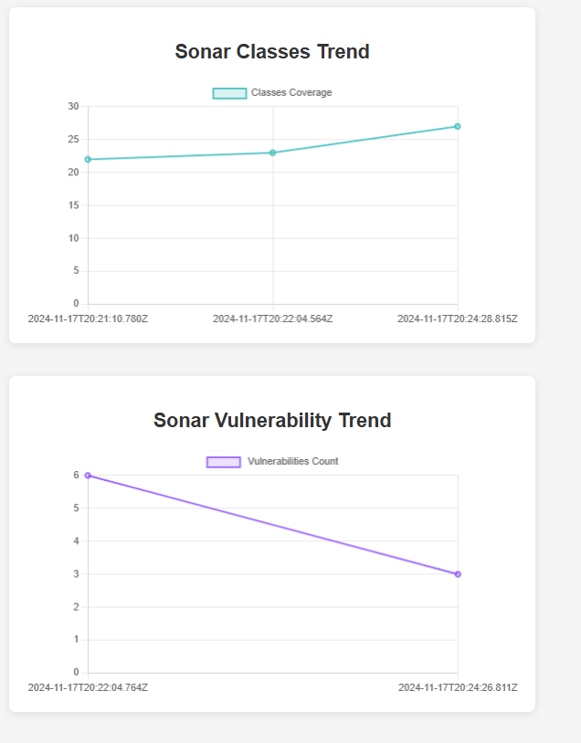

## **Introduction**

[SonarQube](https://www.sonarsource.com/) is widely used for continuous code quality inspection, helping teams detect bugs and vulnerabilities early. However, as projects scale, the backend database can become a bottleneck, affecting performance. Integrating GridDB, a high-performance, distributed NoSQL database, with [SonarQube](https://www.sonarsource.com/) enhances its data processing capabilities, providing faster insights and better scalability for large projects.

This blog will explore how integrating [SonarQube](https://www.sonarsource.com/) with GridDB can help teams monitor and improve code quality over time. We will provide a step-by-step guide to set up this integration and demonstrate its benefits in achieving a more efficient and high-quality development process.

**Why Use GridDB with [SonarQube](https://www.sonarsource.com/)?**

While [SonarQube](https://www.sonarsource.com/) is a powerful tool for static code analysis, it has limitations when it comes to long-term data storage and real-time analytics:

- **Limited Data Retention:** [SonarQube](https://www.sonarsource.com/)'s built-in database may not be optimized for long-term storage of historical code quality data.
- **Performance Bottlenecks:** As the volume of data grows, [SonarQube](https://www.sonarsource.com/)'s performance may degrade, especially when querying historical trends.
- **Lack of Real-time Analytics:** [SonarQube](https://www.sonarsource.com/) primarily focuses on static analysis and may not provide real-time insights into code quality metrics.

**By integrating [SonarQube](https://www.sonarsource.com/) with GridDB, we can:**

- **Enhance data retention:** Store historical code quality data for long-term analysis.
- **Improve performance:** Accelerate query performance and enable real-time insights.
- **Gain deeper insights:** Analyze trends, identify recurring issues, and measure the impact of code improvements.
- **Make data-driven decisions:** Use historical data to optimize development processes and prioritize code quality initiatives.

## Setting Up GridDB Cluster and Spring Boot Integration: For Real-Time Monitoring

The first step is to set up a GridDB cluster and integrate it with our Spring Boot application as follows.

- **Setting up GridDB Cluster**

GridDB provides flexible options to meet different requirements. For development, a single-node cluster on our local machine may be sufficient. However, in production, distributed clusters across multiple machines are typically preferred for improved fault tolerance and scalability. For detailed guidance on setting up clusters based on our deployment strategy, refer to the GridDB documentation.

To set up a GridDB cluster, follow the steps mentioned [here](https://docs.griddb.net/gettingstarted/using-apt/#install-with-apt-get).

- **Setting up SonarCluster**

We can either use an existing [SonarQube](https://www.sonarsource.com/) instance or, for evaluation purposes, set up a [SonarQube](https://www.sonarsource.com/) instance using Docker as shown below.

1. *Pull Image*
   
   `docker run -d --name [SonarQube](https://www.sonarsource.com/) -p 9000:9000 [SonarQube](https://www.sonarsource.com/):latest`
   
   This will pull the latest [SonarQube](https://www.sonarsource.com/) image and run it on port 9000. You can access the [SonarQube](https://www.sonarsource.com/) dashboard by navigating to `http://localhost:9000` in your browser.

2. *Access [SonarQube](https://www.sonarsource.com/):*
   Once the container is running, open a browser and go to `http://localhost:9000`. The default login credentials are:
   
   - **Username**: `admin`
   - **Password**: `admin`

3. *Create an API Access Token:*
   
   - Log in to the [SonarQube](https://www.sonarsource.com/) dashboard.
   - Navigate to **My Account** by clicking on your username at the top right.
   - Go to the **Security** tab.
   - Under the **Tokens** section, click on **Generate Token**.
   - Enter a name for the token (e.g., "API Access") and click **Generate**.
   - Copy the generated token as it will not be shown again.
- **Setting up Spring Boot Application**

Once our GridDB cluster is operational, the next step is connecting it to ourSpring Boot application. The GridDB Java Client API provides the necessary tools to establish this connection. To simplify the process, you can include the `griddb-spring-boot-starter` library as a dependency in our project, which offers pre-configured beans for a streamlined connection setup.

**Project Structure**

Here's a suggested project structure for such an application:

```shell
my-griddb-app
    │   pom.xml
    │   
    ├───src
    │   ├───main
    │   │   ├───java
    │   │   │   └───mycode
    │   │   │       │   MySpringBootApplication.java
    │   │   │       │   
    │   │   │       ├───config
    │   │   │       │       GridDBConfig.java
    │   │   │       │       
    │   │   │       ├───controller
    │   │   │       │       ChartController.java
    │   │   │       │       
    │   │   │       ├───dto
    │   │   │       │       SonarMetricDTO.java
    │   │   │       │       
    │   │   │       └───service
    │   │   │               ChartService.java
    │   │   │               MetricsCollectionService.java
    │   │   │               RestTemplateConfig.java
    │   │   │
    │   │   └───resources
    │   │       │   application.properties
    │   │       │
    │   │       └───templates
    │   │               charts.html
```

This structure separates controllers, models, repositories, services, and the application entry point into distinct layers, enhancing modularity and maintainability. 

**Add GridDB Dependency**

To enable interaction with GridDB in our Spring Boot project, we must include the GridDB Java Client API dependency. This can be accomplished by adding the appropriate configuration to the project build file, such as `pom.xml` for Maven or the equivalent file for Gradle.

Here's an example of how to configure the dependency in the`pom.xml` file:

```xml
<project xmlns="http://maven.apache.org/POM/4.0.0"
  xmlns:xsi="http://www.w3.org/2001/XMLSchema-instance"
  xsi:schemaLocation="http://maven.apache.org/POM/4.0.0 http://maven.apache.org/maven-v4_0_0.xsd">
  <modelVersion>4.0.0</modelVersion>
  <groupId>com.example</groupId>
  <artifactId>my-griddb-app</artifactId>
  <version>1.0-SNAPSHOT</version>
  <name>my-griddb-app</name>
  <url>http://maven.apache.org</url>

  <parent>
    <groupId>org.springframework.boot</groupId>
    <artifactId>spring-boot-starter-parent</artifactId>
    <version>3.2.4</version>
    <relativePath /> <!-- lookup parent from repository -->
  </parent>

  <properties>
    <maven.compiler.source>17</maven.compiler.source>
    <maven.compiler.target>17</maven.compiler.target>
  </properties>

  <dependencies>
    <dependency>
      <groupId>org.springframework.boot</groupId>
      <artifactId>spring-boot-starter-actuator</artifactId>
    </dependency>
    <dependency>
      <groupId>junit</groupId>
      <artifactId>junit</artifactId>
      <version>3.8.1</version>
      <scope>test</scope>
    </dependency>
    <!-- GridDB dependencies -->
    <dependency>
      <groupId>com.github.griddb</groupId>
      <artifactId>gridstore</artifactId>
      <version>5.6.0</version>
    </dependency>
    <!-- Spring Boot dependencies -->
    <dependency>
      <groupId>org.springframework.boot</groupId>
      <artifactId>spring-boot-starter-web</artifactId>
      <exclusions>
        <exclusion>
          <groupId>org.springframework.boot</groupId>
          <artifactId>spring-boot-starter-logging</artifactId>
        </exclusion>
      </exclusions>
    </dependency>
    <dependency>
      <groupId>org.springframework.boot</groupId>
      <artifactId>spring-boot-starter-test</artifactId>
      <scope>test</scope>
    </dependency>
    <dependency>
      <groupId>org.springframework.boot</groupId>
      <artifactId>spring-boot-starter-thymeleaf</artifactId>
    </dependency>
    <!-- JSON processing -->
    <dependency>
      <groupId>com.fasterxml.jackson.core</groupId>
      <artifactId>jackson-databind</artifactId>
      <version>2.15.0</version> <!-- or the latest version -->
    </dependency>
    <!-- Lombok -->
    <dependency>
      <groupId>org.projectlombok</groupId>
      <artifactId>lombok</artifactId>
      <optional>true</optional>
    </dependency>
  </dependencies>
</project>
```

**Configure GridDB Connection**

After adding the GridDB dependency, the next step is configuring the connection details for our GridDB cluster in our Spring Boot application. This is usually configured in the `application.properties` file, where you can specify various settings for the application.

Here’s a quick example of how to set up those connection details:

```properties
GRIDDB_NOTIFICATION_MEMBER=127.0.0.1:10001
GRIDDB_CLUSTER_NAME=myCluster
GRIDDB_USER=admin
GRIDDB_PASSWORD=admin
management.endpoints.web.exposure.include=*
server.port=9090

# [SonarQube](https://www.sonarsource.com/) Configuration
sonar.url=http://localhost:9000
sonar.token=squ_06bfcd665f7ca4115d9d230b0fe19f294246c919
sonar.projectKey=Helloworld
sonar.metricKeys=coverage,duplicated_lines_density,code_smells,bugs,vulnerabilities,complexity,ncloc,comment_lines,lines,functions,classes,files
```

- `griddb.cluster.host`: The hostname or IP address of ourGridDB cluster.
- `griddb.cluster.port`: The port number on which the GridDB cluster is listening.
- `griddb.cluster.user`: The username for accessing the GridDB cluster.
- `griddb.cluster.password`: The password for the specified GridDB user (replace with ouractual password).
- `server.port=9090`: Sets the port on which ourSpring Boot application will run.
- `sonar.projectKey`: This property uniquely identifies your project within [SonarQube](https://www.sonarsource.com/).

**Create GridDB Client Bean**

To interact effectively with GridDB in our Spring Boot application,we need to create a dedicated Spring Bean to manage the GridDB connection. This bean will establish the connection using the parameters defined in the `application.properties` file and will act as the central interface for interacting with the GridDB cluster across the application.

Here's an example of how to define this bean in a Java class named `GridDbConfig.java`:

```java
package mycode.config;

import java.util.Properties;

import org.springframework.beans.factory.annotation.Value;
import org.springframework.context.annotation.Bean;
import org.springframework.context.annotation.Configuration;
import org.springframework.context.annotation.PropertySource;

import com.toshiba.mwcloud.gs.GSException;
import com.toshiba.mwcloud.gs.GridStore;
import com.toshiba.mwcloud.gs.GridStoreFactory;

@Configuration
@PropertySource("classpath:application.properties")
public class GridDBConfig {

 @Value("${GRIDDB_NOTIFICATION_MEMBER}")
  private String notificationMember;

 @Value("${GRIDDB_CLUSTER_NAME}")
  private String clusterName;

 @Value("${GRIDDB_USER}")
  private String user;

 @Value("${GRIDDB_PASSWORD}")
  private String password;

 @Bean
  public GridStore gridStore() throws GSException {
    // Acquiring a GridStore instance
    Properties properties = new Properties();
    properties.setProperty("notificationMember", notificationMember);
    properties.setProperty("clusterName", clusterName);
    properties.setProperty("user", user);
    properties.setProperty("password", password);
    return GridStoreFactory.getInstance().getGridStore(properties);
 }
}
```

## Metric Collection

In this section, we'll delve into the technical flow of how **[SonarQube](https://www.sonarsource.com/)** collects code quality metrics and how these metrics can be transferred and stored in **GridDB** for analysis.

#### 1. **Extracting Metrics from [SonarQube](https://www.sonarsource.com/)**

[SonarQube](https://www.sonarsource.com/) provides a comprehensive set of code quality metrics that can be accessed via its API. These metrics include:

- **Bugs**: Issues in the code that could lead to system malfunctions.
- **Code Smells**: Pieces of code that may not be erroneous but could negatively affect readability and maintainability.
- **Vulnerabilities**: Security-related issues that could make the application susceptible to exploits.
- **Test Coverage**: The percentage of code covered by automated tests.
- **Duplications**: The extent of redundant code across the project.

The process to retrieve these metrics involves making HTTP requests to specific [SonarQube](https://www.sonarsource.com/) API endpoints. For instance:

```http
GET /api/measures/component?component=<project_key>&metricKeys=<metric_1>,<metric_2>
```

#### **API Request Example**

```http
GET /api/measures/component?component=project_xyz&metricKeys=bugs,coverage
```

#### **API Response**

The API responds with the metrics in JSON format, typically including a list of measures. For example:

```json
{
    "component": {
        "key": "Helloworld",
        "name": "Helloworld",
        "description": "A simple Spring Boot 2.x app to send hello world message to a user",
        "qualifier": "TRK",
        "measures": [
            {
                "metric": "duplicated_lines_density",
                "value": "0.0",
                "bestValue": true
            },
            {
                "metric": "classes",
                "value": "2"
            },
            {
                "metric": "functions",
                "value": "18"
            },
            {
                "metric": "lines",
                "value": "211"
            },
            {
                "metric": "coverage",
                "value": "0.0",
                "bestValue": false
            },
            {
                "metric": "ncloc",
                "value": "160"
            },
            {
                "metric": "files",
                "value": "3"
            },
            {
                "metric": "vulnerabilities",
                "value": "0",
                "bestValue": true
            },
            {
                "metric": "bugs",
                "value": "1",
                "bestValue": false
            },
            {
                "metric": "comment_lines",
                "value": "22"
            },
            {
                "metric": "complexity",
                "value": "29"
            },
            {
                "metric": "code_smells",
                "value": "1",
                "bestValue": false
            }
        ]
    }
}
```

The `component` refers to the project identifier (e.g., `"Helloworld`), and the `measures` array contains the actual metrics (e.g., `bugs` and `coverage`) along with their corresponding values.

#### 2. **Storing Data in GridDB**

Once the metrics are fetched from [SonarQube](https://www.sonarsource.com/), they need to be transformed to fit the schema required by **GridDB**. **GridDB** is a time-series database, and its data model focuses on storing time-stamped records efficiently. Therefore, the [SonarQube](https://www.sonarsource.com/) metrics need to be transformed into time-series data that includes the following fields:

- **Timestamp**: The time at which the metric was collected (e.g., `2024-11-17T12:00:00Z`).
- **Metric Name**: The type of metric (e.g., `bugs`, `coverage`).
- **Metric Value**: The value of the metric (e.g., `5`, `80.5`).
- **Component**: The identifier of the project (e.g., `project_xyz`).

A typical transformation flow would include:

1. **Parsing the API response** into individual metric records.
2. **Creating `SonarMetricDTO` objects** to hold the data in the appropriate format, aligning with the **GridDB** schema.

```java
package mycode.dto;

import lombok.AllArgsConstructor;
import lombok.Data;
import lombok.NoArgsConstructor;
import java.util.Date;

import com.toshiba.mwcloud.gs.RowKey;

@Data
@NoArgsConstructor
@AllArgsConstructor
public class SonarMetricDTO {
  @RowKey
  public Date timestamp; // Time of the activity
  private String metricName; // e.g., coverage, bugs
  private String metricValue; // e.g., 80.5, 2
  private String component; // Project key (optional, for identification)
}
merged, conflict)
}
```

Here, the timestamp is set to the current date and time, and the metric name and value are extracted from the [SonarQube](https://www.sonarsource.com/) API response.

#### **Data Injection**

Finally, the transformed data will be loaded into GridDB, where it can be accessed for real-time monitoring and analysis of developer activities. We will insert the data into our database as follows:                            

```java
  TimeSeries<SonarMetricDTO> ts = store.putTimeSeries("sonarMetrics", SonarMetricDTO.class);
  for (SonarMetricDTO metric : metrics) {
     ts.append(metric);
  }Below is the complete `MetricsCollectionService.java`, which implements all the aforementioned steps.
```

**Data Representation in GridDB**

Once the data is stored, GridDB organizes it into time-series entries. The structure is typically as follows:

```bash
Timestamp               Metric Name    Metric Value     Component
2024-11-17T12:00:00Z    bugs           5                project_xyz
2024-11-17T12:00:00Z    coverage       80.5             project_xyz
```

This enables efficient querying of time-series data, supporting real-time analysis and historical tracking of code quality metrics.

Here is the complete code for `MetricsCollectionService`

```java
package mycode.service;

import java.util.ArrayList;
import java.util.Base64;
import java.util.Date;

import org.springframework.beans.factory.annotation.Autowired;
import org.springframework.beans.factory.annotation.Value;
import org.springframework.http.HttpEntity;
import org.springframework.http.HttpHeaders;
import org.springframework.http.HttpMethod;
import org.springframework.http.ResponseEntity;
import org.springframework.scheduling.annotation.Scheduled;
import org.springframework.stereotype.Service;
import org.springframework.web.client.RestTemplate;
import com.fasterxml.jackson.core.JsonProcessingException;
import com.fasterxml.jackson.databind.JsonMappingException;
import com.fasterxml.jackson.databind.JsonNode;
import com.fasterxml.jackson.databind.ObjectMapper;
import com.toshiba.mwcloud.gs.*;
import mycode.dto.SonarMetricDTO;
import java.text.ParseException;
import java.util.List;

@Service
public class MetricsCollectionService {
  @Value("${sonar.url}")
  private String sonarUrl; // e.g., http://localhost:9000

  @Value("${sonar.token}")
  private String sonarToken; // [SonarQube](https://www.sonarsource.com/) authentication token

  @Value("${sonar.projectKey}")
  private String defaultProjectKey; // Default project key from properties

  @Value("#{'${sonar.metricKeys}'.split(',')}")
  private List<String> defaultMetricKeys; // Default metric keys as a list

  @Autowired
  GridStore store;

  @Scheduled(fixedRate = 5000)
  /**
   * Fetches metrics from [SonarQube](https://www.sonarsource.com/), converts them to DTOs, and saves them.
   */
  public void collectMetrics() throws GSException, JsonMappingException, JsonProcessingException, ParseException {

    // Step 1: Authenticate and Fetch Data from [SonarQube](https://www.sonarsource.com/)
    // Step 1: Authenticate and Fetch Data from [SonarQube](https://www.sonarsource.com/)
    List<SonarMetricDTO> metrics = fetchMetricsFromSonar(defaultProjectKey, defaultMetricKeys);

    // Step 2: Save the metrics into GridDB
    TimeSeries<SonarMetricDTO> ts = store.putTimeSeries("sonarMetrics", SonarMetricDTO.class);
    for (SonarMetricDTO metric : metrics) {
       ts.append(metric);
    }
  }

  private List<SonarMetricDTO> fetchMetricsFromSonar(String projectKey, List<String> metricKeys) {
    String metricsQuery = String.join(",", metricKeys); // Create CSV of metric keys
    String apiUrl = sonarUrl + "/api/measures/component?component=" + projectKey + "&metricKeys=" + metricsQuery;

    RestTemplate restTemplate = new RestTemplate();
    HttpHeaders headers = new HttpHeaders();
    headers.set("Authorization", "Basic " + Base64.getEncoder().encodeToString((sonarToken + ":").getBytes()));

    HttpEntity<String> entity = new HttpEntity<>(headers);
    ResponseEntity<String> response = restTemplate.exchange(apiUrl, HttpMethod.GET, entity, String.class);

    // Step 1.1: Parse the JSON Response
    return parseSonarResponse(response.getBody(), projectKey);
  }

  private List<SonarMetricDTO> parseSonarResponse(String responseBody, String projectKey) {
    List<SonarMetricDTO> metrics = new ArrayList<>();

    try {
      // Parse the JSON response using Jackson
      ObjectMapper objectMapper = new ObjectMapper();
      JsonNode rootNode = objectMapper.readTree(responseBody);

      // Access the "measures" array within the response
      JsonNode measuresNode = rootNode.path("component").path("measures");

      // Iterate through the "measures" array and extract the metrics
      for (JsonNode measure : measuresNode) {
        String metricName = measure.path("metric").asText();
        String value = measure.path("value").asText();

        // Create and add the metric to the list
        metrics.add(createMetric(metricName, value, projectKey));
      }
    } catch (Exception e) {
      e.printStackTrace(); // Handle the exception (e.g., log it)
    }

    return metrics;
  }

  /**
   * Helper to create a DTO instance.
   */
  private SonarMetricDTO createMetric(String metricName, String value, String projectKey) {
    SonarMetricDTO dto = new SonarMetricDTO();
    dto.setMetricName(metricName);
    dto.setMetricValue(value + ((int) (Math.random() * 9) + 1));
    dto.setComponent(projectKey);
    dto.setTimestamp(new Date()); // Use current timestamp
    return dto;
  }

}
```

By following above steps, we can effectively extract data from [SonarQube](https://www.sonarsource.com/), load it into GridDB.

## **Data Querying in GridDB and Visualization with Thymeleaf**

Once the data is stored and available in GridDB, the next step is to visualize this data in a way that provides actionable insights.

In this section, we’ll explore how to build a dashboard using Spring Boot, `Thymeleaf`, and `Chart.js` to render charts that display commits and pull request trends over time.

Here are the steps to achieve this:

- **Building the Chart Controller**

The `ChartController` acts as the intermediary between backend data in GridDB and the frontend visualizations displayed on the dashboard. Its responsibilities include handling HTTP requests, interacting with the service layer to fetch data, and passing that data to Thymeleaf templates for rendering.

Here’s how the `ChartController` is implemented:

```java
package mycode.controller;

import org.springframework.beans.factory.annotation.Autowired;
import org.springframework.stereotype.Controller;
import org.springframework.ui.Model;
import org.springframework.web.bind.annotation.GetMapping;

import com.fasterxml.jackson.databind.ObjectMapper;

import mycode.service.ChartService;
import mycode.dto.SonarMetricDTO;

import java.text.SimpleDateFormat;
import java.util.HashMap;
import java.util.List;
import java.util.Map;
import java.util.stream.Collectors;

@Controller
public class ChartController {

  @Autowired
  ChartService chartService;

  @Autowired
  private ObjectMapper objectMapper;

  @GetMapping("/charts")
  public String showCharts(Model model) {
    try {
      List<SonarMetricDTO> events = chartService.getVcsEvents();

      Map<String, Integer> data1 = prepareClassesMetrics(events);
      Map<String, Integer> data2 = prepareVulnerabilitiesMetrics(events);

      // Convert Maps to JSON Strings for use in JavaScript in the Thymeleaf template
      String classesDataJson = objectMapper.writeValueAsString(data1);
      String vulnerabilityDataJson = objectMapper.writeValueAsString(data2);

      model.addAttribute("classesDataJson", classesDataJson);
      model.addAttribute("vulnerabilityDataJson", vulnerabilityDataJson);

    } catch (Exception e) {
      e.printStackTrace();
    }
    return "charts";
  }

  private Map<String, Integer> prepareClassesMetrics(List<SonarMetricDTO> events) {
    Map<String, Integer> commitMap = new HashMap<>();
    SimpleDateFormat dateFormat = new SimpleDateFormat("yyyy-MM-dd'T'HH:mm:ss.SSS'Z'");

    for (SonarMetricDTO event : events) {
      if ("classes".equals(event.getMetricName())) {
        String timestamp = dateFormat.format(event.getTimestamp());
        commitMap.put(timestamp, Integer.valueOf(event.getComponent()));
      }
    }
    return commitMap;
  }

  private Map<String, Integer> prepareVulnerabilitiesMetrics(List<SonarMetricDTO> events) {
    Map<String, Integer> prMap = new HashMap<>();
    SimpleDateFormat dateFormat = new SimpleDateFormat("yyyy-MM-dd'T'HH:mm:ss.SSS'Z'");

    for (SonarMetricDTO event : events) {
      if ("vulnerabilities".equals(event.getMetricName())) {
        String timestamp = dateFormat.format(event.getTimestamp());
        prMap.put(timestamp, Integer.valueOf(event.getComponent()));
      }
    }
    return prMap;
  }

}
```

- **Implementing the Chart Service**

The `ChartService` acts as the business logic layer, encapsulating the operations needed to query GridDB and process the results.

The `ChartService` class retrieves Sonar code quality metrics from a GridStore database container named "sonarMetrics". The service processes each row of the result, mapping fields like Timestamp, MetricName, MetricValue, and Component into a `SonarMetricDTO` object. Finally, it returns a list of these DTOs representing the Sonar code quality metrics.

Here's how the `ChartService` is implemented:

```java
package mycode.service;

import java.text.SimpleDateFormat;
import java.util.ArrayList;
import java.util.Date;
import java.util.List;
import org.springframework.beans.factory.annotation.Autowired;
import org.springframework.stereotype.Service;

import com.toshiba.mwcloud.gs.Container;
import com.toshiba.mwcloud.gs.GridStore;
import com.toshiba.mwcloud.gs.Query;
import com.toshiba.mwcloud.gs.Row;
import com.toshiba.mwcloud.gs.RowSet;

import mycode.dto.SonarMetricDTO;

@Service
public class ChartService {

  @Autowired
  GridStore store;

  public List<SonarMetricDTO> getVcsEvents() throws Exception {

    Container<?, Row> container = store.getContainer("sonarMetrics");
    if (container == null) {
      throw new Exception("Container not found.");
    }
    List<SonarMetricDTO> eventList = new ArrayList<>();


    SimpleDateFormat dateFormat = new SimpleDateFormat("yyyy-MM-dd'T'HH:mm:ss.SSS'Z'");
    Date now = new Date();

    String nowString = dateFormat.format(now);
    String startTime = "1971-12-23T18:18:52.000Z";

    String queryString = "select * where Timestamp >= TIMESTAMP('" + startTime
        + "') and Timestamp <= TIMESTAMP('" + nowString + "')";
    Query<Row> query = container.query(queryString);
    RowSet<Row> rs = query.fetch();

    while (rs.hasNext()) {
      Row row = rs.next();
      SonarMetricDTO event = new SonarMetricDTO();
      event.setTimestamp(row.getTimestamp(0));
      event.setMetricName(row.getString(1));
      event.setMetricValue(row.getString(2));
      event.setComponent(row.getString(3));

      eventList.add(event); 

    }
    return eventList;
  }

}
```

- **Rendering Charts with Thymeleaf**

With the data fetched and processed, the final step is to render the charts on the dashboard using Thymeleaf templates. Thymeleaf allows you to seamlessly integrate backend data into HTML views, making it a great choice for dynamic, data-driven applications.

Below is the implementation of `charts.html`:

```html
<!DOCTYPE html>
<html xmlns:th="http://www.thymeleaf.org">

<head>
  <title>VCS Activity Charts</title>
  <script src="https://cdn.jsdelivr.net/npm/chart.js"></script>
  <style>
    /* Center the content and add padding */
    body {
      font-family: Arial, sans-serif;
      display: flex;
      justify-content: center;
      align-items: center;
      flex-direction: column;
      margin: 0;
      padding: 20px;
      background-color: #f5f5f5;
    }

    /* Style containers for each chart */
    .chart-container {
      background-color: white;
      border-radius: 8px;
      box-shadow: 0 2px 10px rgba(0, 0, 0, 0.1);
      padding: 20px;
      margin: 20px 0;
      width: 100%;
      max-width: 600px;
    }

    /* Canvas styling with a fixed height */
    canvas {
      width: 100% !important;
      height: 300px !important;
    }

    /* Chart title styling */
    h2 {
      text-align: center;
      color: #333;
      font-size: 24px;
      margin-bottom: 20px;
    }
  </style>
</head>

<body>

  <div class="chart-container">
    <h2>Sonar Classes Trend</h2>
    <canvas id="commitChart"></canvas>
  </div>

  <div class="chart-container">
    <h2>Sonar Vulnerability Trend
</h2>
    <canvas id="prChart"></canvas>
  </div>

  <!-- Inline JavaScript block to properly process Thymeleaf variables -->
  <script th:inline="javascript">
    // Thymeleaf will automatically insert the JSON string correctly
    const commitData = [[${ classesDataJson }]];
    const prData = [[${ vulnerabilityDataJson }]];

    // Parse JSON data into JavaScript objects
    const parsedCommitData = JSON.parse(commitData);
    const parsedPrData = JSON.parse(prData);

    // Helper function to sort the data by date keys
    function sortByDate(data) {
      return Object.keys(data)
        .sort((a, b) => new Date(a) - new Date(b))  // Sort the date strings in ascending order
        .reduce((obj, key) => {
          obj[key] = data[key]; // Rebuild the object in sorted order
          return obj;
        }, {});
    }

    // Sort the commit and PR data by date
    const sortedCommitData = sortByDate(parsedCommitData);
    const sortedPrData = sortByDate(parsedPrData);

    // Extract labels (dates) and values (counts) for Commit chart
    const commitLabels = Object.keys(sortedCommitData);
    const commitValues = Object.values(sortedCommitData);

    // Extract labels (dates) and values (counts) for Pull Request chart
    const prLabels = Object.keys(sortedPrData);
    const prValues = Object.values(sortedPrData);

    // Commit Activity Chart
    const commitCtx = document.getElementById('commitChart').getContext('2d');
    const commitChart = new Chart(commitCtx, {
      type: 'line',
      data: {
        labels: commitLabels,
        datasets: [{
          label: 'Classes Coverage',
          data: commitValues,
          backgroundColor: 'rgba(75, 192, 192, 0.2)',
          borderColor: 'rgba(75, 192, 192, 1)',
          borderWidth: 2
        }]
      },
      options: {
        responsive: true,
        maintainAspectRatio: true,
        scales: {
          y: {
            beginAtZero: true
          }
        }
      }
    });

    // Pull Request Activity Chart
    const prCtx = document.getElementById('prChart').getContext('2d');
    const prChart = new Chart(prCtx, {
      type: 'line',
      data: {
        labels: prLabels,
        datasets: [{
          label: ' Vulnerabilities Count',
          data: prValues,
          backgroundColor: 'rgba(153, 102, 255, 0.2)',
          borderColor: 'rgba(153, 102, 255, 1)',
          borderWidth: 2
        }]
      },
      options: {
        responsive: true,
        maintainAspectRatio: true,
        scales: {
          y: {
            beginAtZero: true
          }
        }
      }
    });
  </script>


</body>

</html>
```

### Running the Project

To run the project, execute the following command to build and run our application:

```shell
mvn clean install && mvn spring-boot:run  
```

### Accessing the Dashboard

Once the application is up and running, open a web browser and navigate to `http://localhost:9090`. This URL will display our Thymeleaf-based dashboard, where we can view charts visualizing commit activity and pull request activity over time.



The charts on this dashboard is dynamically rendered using data retrieved from Github and processed by the application’s `ChartService`. 

**Data Storage in GridDB:**

The GridDB Shell tool allows for  access and querying of data via the command line, as illustrated below.

```
gs[public]> select * from sonarMetrics;
gs[public]> get 39
```

### **Conclusion:**

Integrating [SonarQube](https://www.sonarsource.com/) with GridDB for metrics collection provides a powerful mechanism to monitor, analyze, and improve code quality over time. By leveraging [SonarQube](https://www.sonarsource.com/)'s REST API, organizations can extract critical metrics such as bugs, code smells, and test coverage. Storing these metrics in GridDB's high-performance time-series database ensures efficient historical tracking and supports real-time analysis.

This streamlined approach empowers development teams to:

- **Detect Trends**: Identify patterns of improvement or regression in code quality.
- **Enhance Decision-Making**: Base development priorities on quantitative metrics.
- **Ensure Long-Term Sustainability**: Continuously monitor and optimize codebases.

By automating metric collection and storage, teams can focus on addressing root causes of technical debt and improving overall software health. This integration is not just a monitoring tool but can be a strategic investment in building maintainable, secure, and high-quality software systems.
